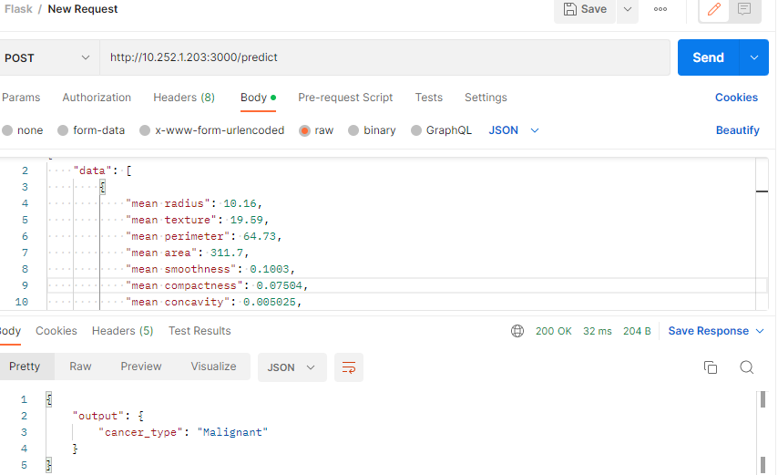

[](https://github.com/Aduzona/CI_CD_ML_Model_Deployment_using_Flask_and_Docker/actions/workflows/main.yml)

## Content

* Model Deployment(What and Why)
* Flask
* Docker
* Container and Images overview
* Hands-on

## Model Deployment(What and Why)


After model training, model should be saved.

But in production environment this processes should occur,
* Live Data
* Feature Engineering
* Feature Selection
* Model Prediction: No model building here, we will use same model we built to make predicition.
* Prediction

We will be using joblib library to save the model, then we will be using the saved model to deploy it using flask.
We will create an API then we will deploy it using Docker.

## Flask

* Flask is a Microframework built in python, we use flask to build APIs for web application, so we will have some urls. Other Options are Django, Fast API e.t.c.

* What is a web framework? A web framework represent a list of libraries, modules that helps a developer in building a web application easily.
* Flask is simple and easy to use but its quite extensible.
* FLask supports few extensions that helps us to work on database for a web application.
* We would build a RESTApi in flask model deployment.
* An API is an application Programming Interface which is basically as set of rules that allow programs to talk to each other For e.g. a backend server and UI talking to each other via API.
* REST in RESTApi stands for REpresentational State Transfer. A set of rules that programmers follow while developing the API.
* Each URL of an API should contain data that is sent (request) and the data that we get back from API is callsed response.

build flask api in deploy folder, app.py

## Docker

* "but it works on my machine". This is a popular phrase that can be heard in software development field.
* This headache occurs when you have developed an entire application on your system. which works on your system but may not work on some other system (tester's system or other env).
* Why does this happen? The reason is that a whole application does not just depend on the code that you write for building it. it depends on multiple factors like the OS, the dependencies, the libraries. configuration, framework and so on.
* Now whenever you pass on this code to tester or deploy it on any environment then you need to setup the whole environment starting from the OS.
* To solve this problem the Hypervisor came into picture. You may be aware of virtualbox. VMWare e.t.c.
* Every system has some hardware on which we install an OS. Now on this OS we install a Hypervisor(e.g. VirtualBox).
* Now in the Hypervisor you can install an os and then have your application set up on it. Then you can create an image of the OS that can be used by the tester or else use the image to deploy your application.
* This image contains all the dependencies,framework,libraries e.t.c. When the tester creates an instance of the image they can run your whole application without any hazzles. Same goes while deploying the code.
* This solves the problem but there is on disadvantage with this approach.If on the server you have multiple applications running on Hypervisor share the same hardware of the the server which is not feasible.

<ul>Hypervisor</ul>

* This particular problem is solved by docker containers
* Docker follows the concept of **develop**, **ship** and **run** anywhere.
* Containers can be considered as a process that works like Hypervisor but without guest OS for each application. Hence there is no wastage of resources.
* Even in docker you can have multiple containers running but they share the host operating system and they can be interdependent of each other.
* The docker containers are feasible, faster and smaller.
* In short you can sum up the above explanation as containers are process running on top of host os and VMs are servers using the host haedware and OS resources.


<ul>Docker</ul>


## Container and Images overview

**Docker Container**

* As per the definition a container is a standard unit of software that packages up code and all its dependencies so the application runs quickly and reliably from one computing environment to another.
* They are instances of docker image that is run using the run command, meaning to run a docker container, you need to run an image(docker image).
* They are just another process running in your system.
* Multiple containers can run on same machine and share the resources of that machine.
* The containers start running when you build and run an image.


<ul>Docker Details</ul>

Now compare both

<ul>container vs virtual machine</ul>


**Docker images**

* You write a dockerfile which contains a list of instructions how to run the application.
* The docker image is build from these instructions that can be then used to create multiple instances of these images(containers) using the run command.
* You use the build command to execute the instructions in dockerfile and create an image. Then you can use this image to create multiple instances i.e containers. For that, you use the run commands on the built image.
* This image can be stored in docker hub(a repo that contains all the images) and can be pulled when required.
* Docker hub contains a lot of images. Some of them are official images.
* You can either use the dockerfile to build an image in other environment or else you can take the image and run in on other environement.

## Hands-on

### Using Python environment

* Create and activate environment (using Powershell in vscode)
  
  ```
  python3 -m venv venv
  .\\venv\\Scripts\\Activate
  ```

* create `requirements.txt` add libraries and run it.
  
  ```
  pylint==2.15.8
  pytest==7.2.0
  black==22.12.0
  pytest-cov==4.0.0
  pandas==1.5.2
  scikit-learn
  matplotlib==3.6.2
  seaborn==0.12.2
  Flask==2.2.2
  joblib==1.2.0
  jupyterlab==3.5.2
  ```

```
  pip install -r requirements.txt
```
* run `jupyter lab`, jupyter lab opens.
* run the python notebook.


### Using conda

Ensure Flask, docker and postman are installed.

* check enviroment list `conda env list`
* create environment with conda `conda create -n breast_cancer python=3.9.13` . Use python version in your system for testing. 
* See the list again `conda env list`
* Activate the environment `conda activate breast_cancer`
* If  error, initialize your shell name e.g on:
  * command prompt `conda init cmd.exe`
  *  or git bash `conda init bash`
  *  restart shell
  * Activate the environment `conda activate breast_cancer`

**Install Libraries needed in new environment**

* Pandas and numpy are installed at the same time `pip install pandas`
* When sklearn is installed, joblib,scipy e.t.c is also installed with it.`pip install sklearn`
* Install visualization library seaborn and matplotlib `pip install seaborn matplotlib`
* See all installed libraries: `conda list`
* Install jupyter notebook `pip install jupyter notebook`
* Start jupyter notebook `jupyter notebook`

### Using Saved Model for prediction

* create and save model model using `Cancer_prediction.ipynb`
* create a deploy folder `deploy`:
  * add `__init__.py`, `model.pkl`
  * create flask `app.py`
* run in powershell `python app.py`
* open postman and create a post request and test the api.

```json
{
    "data": [
        {
            "mean radius": 10.16,
            "mean texture": 19.59,
            "mean perimeter": 64.73,
            "mean area": 311.7,
            "mean smoothness": 0.1003,
            "mean compactness": 0.07504,
            "mean concavity": 0.005025,
            "mean concave points": 0.01116,
            "mean symmetry": 0.1791,
            "mean fractal dimension": 0.06331,
            "radius error": 0.2441,
            "texture error": 2.09,
            "perimeter error": 1.648,
            "area error": 16.8,
            "smoothness error": 0.01291,
            "compactness error": 0.02222,
            "concavity error": 0.004174,
            "concave points error": 0.007082,
            "symmetry error": 0.02572,
            "fractal dimension error": 0.002278,
            "worst radius": 10.65,
            "worst texture": 22.88,
            "worst perimeter": 67.88,
            "worst area": 347.3,
            "worst smoothness": 0.1265,
            "worst compactness": 0.12,
            "worst concavity": 0.01005,
            "worst concave points": 0.02232,
            "worst symmetry": 0.2262,
            "worst fractal dimension": 0.06742
        }
    ]
}
```



**Folder Structure**

deploy
    -app.py
    -Dockerfile
Notebook
    -breast_cancer.csv
    -Cancer_prediction.ipynb
    -model.pkl
    -test.ipynb
Makefile
README.md
request.json
requirements.txt

request.json is a contains sample of data parsed to the `app.py` to read.
```py
req = request.get_json()
input_data = req['data']
```
see `app.py` for more details


## Deploy test

Because we installed Jupyter notebook in the previous environements, and other unnecessary libraries where installed.we will create new environment in the deploy folder.
* create a new environment `conda create -n deploy python=3.9.13`
* Activate the environment `conda activate deploy`
* Install required libraries `pip install pandas sklearn flask joblib`
* list installed libraries `conda list`
* run the server `python app.py`
* Access the url ``
* Press `CTRL+c` to quit
## References

* [ML Dev with Flask and Docker](https://www.youtube.com/watch?v=2X-L9w68898&ab_channel=BoardInfinity)
* [ML Dev with Flask and Docker2](https://github.com/shreyas219/breast_cancer_classification)